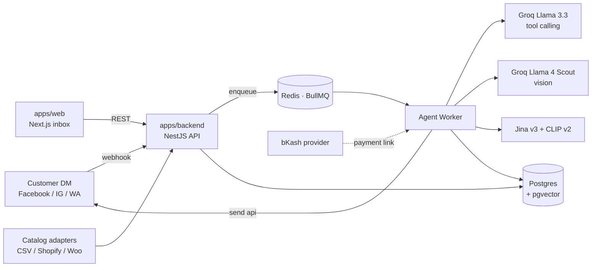

# Jobab architecture

**Read this before touching code.** If you understand this single document you
can navigate any file in the repo, predict where a new feature should live,
and add a route end-to-end without grepping.

It's not theory — every pattern below is already used in the codebase, with
file references you can open in another tab.

---

## Table of contents

- [The 30-second tour](#the-30-second-tour)
- [System diagram](#system-diagram)
- [The agent loop](#the-agent-loop)
- [Tech stack](#tech-stack)
- [Monorepo layout](#monorepo-layout)
- [Data model](#data-model)
- [The single source of truth: `@jobab/shared`](#the-single-source-of-truth-jobabshared)
- [Backend pattern: NestJS feature modules](#backend-pattern-nestjs-feature-modules)
- [Frontend pattern: `page` → `Client` → `useState` → sections](#frontend-pattern-page--client--usestate--sections)
- [How data flows end-to-end](#how-data-flows-end-to-end)
- [Conventions cheat-sheet](#conventions-cheat-sheet)
- [Adding a new feature in 7 steps](#adding-a-new-feature-in-7-steps)
- [What lives where — every directory explained](#what-lives-where--every-directory-explained)

---

## The 30-second tour

Three packages, two of them apps:

```
apps/backend  →  NestJS API + agent worker (Postgres + Redis + Groq LLM)
apps/web      →  Next.js 14 dashboard (the inbox merchants use)
packages/shared → Zod schemas + types — the contract both apps depend on
```

The backend is the **only** place that talks to the database, the LLM, Meta,
and bKash. The web app talks to the backend over REST + a session cookie.
Mobile (`apps/mobile`) is scaffolded but optional.

Three runtime processes during dev:

```
backend API           — answers HTTP, validates webhooks, queues agent work
backend worker        — drains the BullMQ queue, runs the LLM loop, replies
web (Next.js)         — renders the dashboard, talks only to the API
```

Postgres + Redis run in Docker. That's the whole picture.

---

## System diagram



Two backend processes share one codebase:

- **API** (`start:dev`) — webhooks, the dashboard REST API, auth.
- **Agent worker** (`start:worker:dev`) — drains the BullMQ queue and runs the
  agent loop, so a slow LLM call never blocks an HTTP request.

---

## The agent loop

```
customer message
    │
    ▼
load context (system prompt + last 40 turns + image URLs)
    │
    ▼
call LLM with tool definitions (≤ LLM_MAX_ITERATIONS)
    │
  tool calls? ──no──▶ send final reply via Send API
    │
    yes
    │
    ▼
execute tool ─ search_catalog        (top-N in-stock products)
              ─ check_stock           (live qty + price for a variant)
              ─ match_product_by_image(visual ANN → describe-then-search → vision LLM)
              ─ save_customer_detail  (grounded against the customer's own messages)
              ─ create_order          (order guardrail: fields · stock · total · duplicate)
              ─ handoff_to_human      (classified: complaint / refund / payment_dispute / …)
    │
    └──▶ append result, re-invoke
```

Every run is recorded as an `AgentRun` (model, tokens, cost, latency, the tool
calls it made) — that's what powers the inbox Activity feed and the Analytics
page. The loop bails immediately if a conversation is in `human` or `closed`
status, so a merchant takeover is always respected.

---

## Tech stack

| Layer         | Choice                                                                 |
| ------------- | ---------------------------------------------------------------------- |
| Backend       | NestJS 10, TypeScript                                                  |
| ORM / DB      | Prisma + PostgreSQL 16 with **pgvector**                               |
| Queue         | BullMQ on Redis                                                        |
| LLM           | Groq — Llama 3.3 (tool calling), Llama 4 Scout (vision)                |
| Embeddings    | Jina v3 (text) + CLIP v2 (image), with a describe-then-search fallback |
| Frontend      | Next.js 14 (app router), React, Tailwind CSS                           |
| Contract      | Zod schemas in `@jobab/shared`                                         |
| Payments      | bKash (dev fallback without merchant creds)                            |
| Notifications | WhatsApp + web push (merchant alerts)                                  |
| Observability | Pino logs, optional Sentry + Langfuse                                  |
| Tooling       | pnpm workspaces, Jest, ESLint, Prettier                                |

---

## Monorepo layout

```
.
├── apps/
│   ├── backend/        NestJS · Prisma · BullMQ
│   ├── web/            Next.js 14 (App Router) + Tailwind
│   └── mobile/         React Native (scaffolded)
├── packages/
│   └── shared/         Zod schemas + types shared between backend and web
├── docs/               ADRs, architecture notes, runbooks
├── design-prototype/   Original Claude Design prototype, kept as reference
├── docker-compose.yml  Postgres (pgvector) + Redis
└── ARCHITECTURE.md     ← you are here
```

**pnpm workspaces.** Adding `@jobab/shared` to either app uses
`"@jobab/shared": "workspace:*"` — pnpm symlinks the source. Edit a schema in
one place and both apps see it.

---

## Data model

Key Prisma models (`apps/backend/prisma/schema.prisma`):

- **Organization** — the shop. Holds AI instructions, catalog source, status.
- **User / Membership / Invite / AuditEvent** — auth + RBAC (`owner` / `admin` /
  `agent`).
- **Page** — a connected channel (`facebook` / `instagram` / `whatsapp`).
- **Product / ProductVariant** — catalog, with `textEmbedding` + `imageEmbedding`
  (pgvector) for search and photo matching.
- **Conversation** — a customer thread. Carries channel, assignee, captured
  `customerName/Phone/Address`, `status` (`bot` → `needs_human` → `human` →
  `closed`), and `handoffCategory` / `handoffReason` for complaint triage.
- **Message** — in/out, sender (`customer` / `agent` / `human`), JSON
  attachments (images + AI match candidates).
- **Tag / ConversationTag** — reusable colour-coded labels applied to chats.
- **Note** — internal merchant notes on a conversation.
- **Order** — items, totals, `paymentStatus`, `status` (created → confirmed →
  shipped → delivered → cancelled).
- **Comment / CommentRule** — social comments + per-intent automation.
- **AgentRun** — per-run model/token/cost/latency/tool-call telemetry.
- **DeviceToken** — web-push registrations.

---

## The single source of truth: `@jobab/shared`

This is the most important idea in the codebase. Everything else falls out of it.

The web app and the backend both need to agree on what a `Conversation` looks
like, what `POST /auth/login` accepts, what the order status enum contains, etc.

Hand-mirroring those shapes is a recipe for drift, so we put them in
`packages/shared/src/` as **Zod schemas**:

- `auth.ts` · `LoginBodySchema`, `SignUpBodySchema`, `AcceptInviteBodySchema`
- `conversation.ts` · `ConversationSchema`, `MessageSchema`, `TagSchema`, `NoteSchema`
- `order.ts` · `OrderSchema`, `OrderListItemSchema`, `SetOrderStatusBodySchema`
- `product.ts` · `ProductSchema`, `ProductVariantSchema`, `*SyncBodySchema`
- `enums.ts` · every status / role / platform enum
- … and so on per domain

The backend imports these and calls `Schema.parse(body)` to validate at runtime
(see `conversations/conversations.controller.ts`).

The web imports the inferred TypeScript types
(`type Conversation = z.infer<typeof ConversationSchema>`) for compile-time
safety.

The Swagger UI imports them too — `apps/backend/src/swagger/zod-registry.ts`
turns every shared schema into an OpenAPI `components/schemas/<Name>`, which
the controller decorators reference via `$ref`. Three layers, one source.

**Rule:** if a shape crosses the network, it lives in `@jobab/shared`. If you
need to add a field, edit it here once and propagate.

---

## Backend pattern: NestJS feature modules

`apps/backend/src/` is one folder per feature, each with the same 3 files
(plus tests when relevant):

```
conversations/
  conversations.module.ts       wires controller + service + deps into DI
  conversations.controller.ts   HTTP routes + Swagger decorators
  conversations.service.ts      business logic; talks to Prisma + other services
  conversations.service.spec.ts (optional) Jest unit tests, colocated
```

That's it. No `dto/`, `entities/`, `repositories/` ceremony — Zod handles DTOs,
Prisma handles entities, and the service IS the repository.

### What goes in each file

| File              | Owns                                                                                     | Doesn't own                                    |
| ----------------- | ---------------------------------------------------------------------------------------- | ---------------------------------------------- |
| `*.controller.ts` | URL routing, Zod parsing (`Schema.parse(body)`), Swagger decorators, calling the service | DB queries, business rules, external API calls |
| `*.service.ts`    | Business logic, transactions, calling Prisma + other services                            | HTTP concerns, request parsing                 |
| `*.module.ts`     | The Nest `@Module()` that wires controller + service + imports                           | Anything else                                  |

### Cross-cutting concerns

Not every folder is a feature. Some are infrastructure:

```
common/          Shared filters, decorators, encryption
config/          Zod-validated env loader (refuses to boot on missing keys)
prisma/          PrismaService singleton; one client per process
observability/   Sentry + Langfuse + pino integration
queue/           BullMQ producer / consumer wiring
swagger/         Zod → OpenAPI bridge + reusable @ApiX decorators
```

### Two processes, one codebase

The API (`pnpm start:dev`) and the agent worker (`pnpm start:worker:dev`)
share the same NestJS module graph but boot from different entry points:

```
src/main.ts       → starts the HTTP server (api process)
src/agent/worker.ts → starts the BullMQ consumer (worker process)
```

A slow LLM call never blocks an HTTP request because the queue sits between them.

---

## Frontend pattern: `page` → `Client` → `useState` → sections

Every route in `apps/web/app/<route>/` follows the same four-file shape. Once
you internalise it you can navigate any page in the app:

```
app/<route>/
  page.tsx              server entry — fetches initial data, returns <RouteClient initial={...} />
  <Route>Client.tsx     the orchestrator — layout, view-switching, prop wiring
  use<Route>State.ts    all hooks, fetches, mutations for this route
  <Section>.tsx         per-section UI; each does ONE thing
```

### Why this shape

- **`page.tsx` is dumb.** Server-side data fetch only. It hands the result to
  the client component. Keeps the route declarative.
- **`<Route>Client.tsx` is the orchestrator.** It owns layout, view switching
  (e.g. mobile/desktop), and prop wiring. It should be < 200 LOC. If it grows,
  extract another section.
- **`use<Route>State.ts` is the state machine.** All `useState`, all `useEffect`,
  all `usePoll`, all `api.*` calls live here. The orchestrator + sections call
  into it; they never touch the API directly. Easy to grep "how is this
  mutated?" — it's in one file.
- **Each `<Section>.tsx` is stateless.** Receives the slice of state it needs
  as props, fires callbacks up. Easy to test, easy to reuse, easy to delete.

### A worked example: `app/orders/`

```
app/orders/
  page.tsx              server: fetches initial order list
  OrdersClient.tsx      orchestrator (121 LOC): filter chips, list, print trigger
  useOrdersState.ts     state (89 LOC): orders, polling, mutations, derived totals
  OrderCard.tsx         section (137 LOC): one row of the orders list
  StatusChip.tsx        section (113 LOC): status pill + lifecycle action button
  PrintableInvoice.tsx  section (215 LOC): print-only invoice layout
```

This file used to be 598 LOC of one mega-component. The split makes the same
behaviour rendering-identical but each file has a single job.

### Another: `app/onboarding/`

A 7-step wizard, one file per step:

```
app/onboarding/
  page.tsx              server: fetches initial OnboardingStatus
  OnboardingClient.tsx  orchestrator (135 LOC): header, progress, step switch
  useOnboardingState.ts state (285 LOC): every step's state + all mutations
  Primary.tsx           shared brand submit button
  ShopNameStep.tsx      ┐
  ConnectPageStep.tsx   │
  CatalogStep.tsx       │ one focused component per step
  AiInstructionsStep.tsx│
  WhatsAppStep.tsx      │
  TestStep.tsx          │
  DoneStep.tsx          ┘
```

The orchestrator's job is a `switch (step)` rendering the right step
component with the right props from the hook. That's all.

### Shared web bits

Cross-route reusable pieces live one level up:

```
components/
  inbox/      shared between Inbox, Mobile drawer, RightRail
  layout/     AppShell, NavRail, AvatarMenu
  shared/     Toast, EmptyState, Jamdani (brand mark), ConnectivityBanner
lib/
  api.ts      a typed `api` object — every endpoint is a method
  types.ts    re-exports of @jobab/shared types
  use-poll.ts setInterval as a hook with cleanup
  use-tab-badge.ts
  cn.ts       classnames helper
```

If you find yourself prop-drilling a primitive through 3 routes, hoist it to
`components/shared/`. If only this route uses it, keep it co-located.

---

## How data flows end-to-end

Take a single user action and watch it travel:

> Merchant clicks "Mark paid" on an order card

```
1. OrderCard.tsx           onClick={() => onMarkPaid(order.id)}
2. OrdersClient.tsx         markPaid (from useOrdersState)
3. useOrdersState.ts        api.markOrderPaid(id)
4. lib/api.ts               POST /orders/:id/mark-paid (cookie auth)
5. orders.controller.ts     @Post(':id/mark-paid') → svc.markPaid
6. orders.service.ts        prisma.order.update(...) + audit event
7. (response)               OrderSchema-shaped JSON
8. useOrdersState.ts        setOrders(prev => prev.map(o => merge))
9. OrderCard.tsx            re-renders with new payment status
10. Toast                   "Marked as paid."
```

The same pattern holds for every mutation. Find the section, follow the
callback up to the hook, find the API call, jump to the controller, read the
service. Five files, predictable order, no surprises.

---

## Conventions cheat-sheet

| Thing                | Convention                                                                                                                         |
| -------------------- | ---------------------------------------------------------------------------------------------------------------------------------- |
| File names           | `kebab-case.ts` for backend, `PascalCase.tsx` for React components, `use-foo.ts` for hooks, `useFoo.ts` if co-located with a route |
| Component exports    | Named exports (`export function FooBar()`). One component per file unless < 20 LOC.                                                |
| Folder names         | lowercase, one feature per folder                                                                                                  |
| State hooks          | `use<Route>State.ts` co-located with the route                                                                                     |
| API client           | `lib/api.ts` — one method per endpoint, typed against `@jobab/shared`                                                              |
| Network shapes       | Always `@jobab/shared`. Never duplicate.                                                                                           |
| Backend body parsing | `Schema.parse(body)` inside the controller. Never trust `@Body() body: unknown` without parsing.                                   |
| Tests                | Colocated `*.spec.ts` next to the source. Jest.                                                                                    |
| Maximum file size    | Aim for < 200 LOC, hard ceiling at ~300. Above that, ask "does this file do more than one thing?"                                  |
| Imports              | Tooling-managed: prettier + lint-staged on commit.                                                                                 |

---

## Adding a new feature in 7 steps

You've been asked to add a "Discount codes" feature. Here's the playbook.

### 1 · Define the contract in `@jobab/shared`

```ts
// packages/shared/src/discount.ts
export const DiscountSchema = z.object({
  id: z.string(),
  code: z.string().min(1).max(32),
  percent: z.number().int().min(1).max(100),
  expiresAt: z.string().datetime().nullable(),
});
export type Discount = z.infer<typeof DiscountSchema>;

export const CreateDiscountBodySchema = z.object({
  code: z.string().min(1).max(32),
  percent: z.number().int().min(1).max(100),
  expiresAt: z.string().datetime().nullable(),
});
```

Re-export from `packages/shared/src/index.ts`.

### 2 · Add a Prisma model + migration

```prisma
// apps/backend/prisma/schema.prisma
model Discount {
  id             String   @id @default(cuid())
  organizationId String
  code           String
  percent        Int
  expiresAt      DateTime?
  createdAt      DateTime @default(now())
  organization   Organization @relation(fields: [organizationId], references: [id])
  @@unique([organizationId, code])
}
```

```bash
pnpm --filter @jobab/backend prisma:migrate
```

### 3 · Add a backend feature module

```
apps/backend/src/discounts/
  discounts.module.ts
  discounts.controller.ts
  discounts.service.ts
  discounts.service.spec.ts
```

Register the new shared schemas in `apps/backend/src/swagger/zod-registry.ts`
so the Swagger UI picks them up. Decorate the controller with `@ApiAuthCookie`,
`@ApiAuthErrors`, `@ApiZodBody('CreateDiscountBody')`, `@ApiZodOk('Discount')`,
`@ApiNotFound('Discount')` — see `apps/backend/src/swagger/decorators.ts`.

Register `DiscountsModule` in `apps/backend/src/app.module.ts`.

### 4 · Add the API client method

```ts
// apps/web/lib/api.ts
discounts: {
  list: () => get<Discount[]>('/discounts'),
  create: (body: CreateDiscountBody) => post<Discount>('/discounts', body),
  delete: (id: string) => del<void>(`/discounts/${id}`),
}
```

### 5 · Add the route

```
apps/web/app/discounts/
  page.tsx               server: api.discounts.list()
  DiscountsClient.tsx    orchestrator: layout, "new code" button, list
  useDiscountsState.ts   state: discounts, create, delete
  DiscountRow.tsx        section: one row
  NewDiscountModal.tsx   section: create form
```

### 6 · Wire it into the nav

`apps/web/components/layout/NavRail.tsx` gets one more icon. Done.

### 7 · Ship

```bash
pnpm typecheck && pnpm lint
git add -A && git commit -m "feat(discounts): add discount-code management"
```

The pre-commit hook runs prettier + eslint. Swagger UI now shows the new tag
under `/docs`. The README API table updates from Swagger automatically.

---

## What lives where — every directory explained

### Backend

| Path                                                | What                                                                                 |
| --------------------------------------------------- | ------------------------------------------------------------------------------------ |
| `apps/backend/src/main.ts`                          | API entry point. Helmet, CORS, Swagger setup, cookie parser.                         |
| `apps/backend/src/agent/worker.ts`                  | Worker entry point. BullMQ consumer + agent loop.                                    |
| `apps/backend/src/agent/`                           | The LLM agent — tool calling, providers (Groq), tool definitions in `tools/`.        |
| `apps/backend/src/auth/`                            | Login, sign-up, sessions, the `@Public` decorator, role guard, invite tokens.        |
| `apps/backend/src/conversations/`, `tags/`, `notes` | Inbox CRUD + AI handoff.                                                             |
| `apps/backend/src/orders/`                          | Orders + the `OrderGuardrail` that validates stock + total + duplicates before mint. |
| `apps/backend/src/catalog/`                         | Products + the `CatalogSyncService` adapter for CSV / Shopify / Woo.                 |
| `apps/backend/src/webhooks/meta.controller.ts`      | Meta webhook entry with HMAC signature verification.                                 |
| `apps/backend/src/embeddings/`, `vision/`           | Jina + Groq vision adapters.                                                         |
| `apps/backend/src/messenger/`                       | Outbound Send-API integration.                                                       |
| `apps/backend/src/notifications/`                   | WhatsApp / push merchant alerts.                                                     |
| `apps/backend/src/observability/`                   | Sentry + Langfuse + pino.                                                            |
| `apps/backend/src/common/`                          | Filters, encryption service, decorators.                                             |
| `apps/backend/src/config/`                          | The Zod-validated env loader.                                                        |
| `apps/backend/src/swagger/`                         | Zod→OpenAPI bridge + reusable `@ApiX` decorators.                                    |
| `apps/backend/prisma/`                              | Schema, migrations, seed.                                                            |

### Frontend

| Path                                           | What                                                                             |
| ---------------------------------------------- | -------------------------------------------------------------------------------- |
| `apps/web/app/<route>/page.tsx`                | Server entry, data fetch.                                                        |
| `apps/web/app/<route>/<Route>Client.tsx`       | Orchestrator.                                                                    |
| `apps/web/app/<route>/use<Route>State.ts`      | All state + mutations for this route.                                            |
| `apps/web/app/<route>/<Section>.tsx`           | Per-section UI.                                                                  |
| `apps/web/app/layout.tsx`                      | Root layout — fonts, toast provider, connectivity banner.                        |
| `apps/web/components/inbox/`                   | Shared inbox pieces (RightRail, TagBar, ActivityList…).                          |
| `apps/web/components/layout/`                  | AppShell, NavRail, AvatarMenu, MobileNav.                                        |
| `apps/web/components/shared/`                  | Cross-app primitives (Toast, EmptyState, Jamdani, …).                            |
| `apps/web/lib/api.ts`                          | The typed API client.                                                            |
| `apps/web/lib/use-poll.ts`, `use-tab-badge.ts` | Generic hooks.                                                                   |
| `apps/web/lib/types.ts`                        | Re-exports of `@jobab/shared` types.                                             |
| `apps/web/app/api/backend/[...path]/route.ts`  | The dev proxy that forwards `/api/backend/*` to the NestJS backend with cookies. |

### Shared

| Path                              | What                                          |
| --------------------------------- | --------------------------------------------- |
| `packages/shared/src/<domain>.ts` | Zod schemas + inferred types for that domain. |
| `packages/shared/src/index.ts`    | Barrel — re-exports everything.               |

---

## TL;DR for the next person reading this

1. **`@jobab/shared` is the contract.** Add fields there; both apps follow.
2. **Backend = feature modules** with `controller / service / module` (+ spec).
3. **Frontend route = `page → Client → useState → sections`.** Keep the
   orchestrator thin, push state into the hook, make sections stateless.
4. **Aim for < 200 LOC per file.** If a file does more than one thing, split it.
5. **Swagger is the API source of truth.** Decorators on controllers; rich
   docs live in code, not in scattered Markdown.
6. **Tests live next to the code.** `*.spec.ts` colocated.
7. **When in doubt, copy a sibling.** `app/orders/` and `app/onboarding/` are
   the cleanest examples of the frontend pattern.

If something in the repo violates this doc, it's a bug — either the code or
the doc needs to change. The repo is the source of truth; this is a map to it.

Happy hacking.
