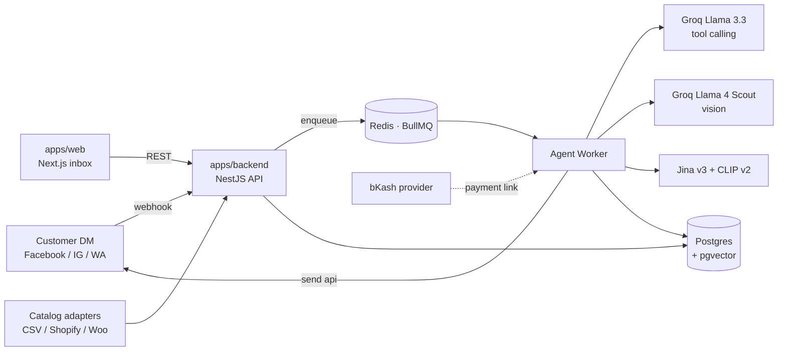

# Jobab architecture

This is the map. If you read it once you'll know where every kind of code
lives, why it's there, and where new code should go. The patterns in this
doc aren't aspirational — every one is already in the repo, with file
paths you can open in another tab.

The repo isn't huge but it has real machinery. Three runtime processes, an
AI agent loop, a payment integration, two webhook channels, a queue, a
vector database. The structure exists so all of that stays readable as
features get added.

---

## Contents

- [The 30-second tour](#the-30-second-tour)
- [The shape and why it's that shape](#the-shape-and-why-its-that-shape)
- [System diagram](#system-diagram)
- [The agent loop](#the-agent-loop)
- [Tech stack at a glance](#tech-stack-at-a-glance)
- [Monorepo layout](#monorepo-layout)
- [Data model](#data-model)
- [The contract: `@jobab/shared`](#the-contract-jobabshared)
- [Backend pattern: feature modules](#backend-pattern-feature-modules)
- [Frontend pattern: page → Client → useState → sections](#frontend-pattern-page--client--usestate--sections)
- [How data flows end-to-end](#how-data-flows-end-to-end)
- [Conventions](#conventions)
- [Adding a new feature in 7 steps](#adding-a-new-feature-in-7-steps)
- [Directory reference](#directory-reference)

---

## The 30-second tour

Three packages. Two of them are real apps; one is a contract.

```
apps/backend       NestJS API + agent worker (Postgres + Redis + Groq LLM)
apps/web           Next.js 14 dashboard (the inbox merchants use)
apps/mobile        Expo scaffold (Phase 2)
apps/docs          VitePress book site (this and the rest of /docs)
packages/shared    Zod schemas that backend and web both depend on
```

The backend is the only process that talks to the database, the LLM, Meta,
and bKash. The web app talks to the backend over REST with a session cookie.
The mobile app is a scaffold — we ship it when the web app and backend are
proven.

During dev there are three processes:

```
backend API           answers HTTP, validates webhooks, queues agent work
backend worker        drains the BullMQ queue, runs the LLM loop, sends replies
web (Next.js)         renders the dashboard, talks only to the API
```

Postgres and Redis run in Docker (`pnpm infra:up`). That's the whole picture.

---

## The shape and why it's that shape

You might wonder why the backend is split in two — an API and a worker — and
why there's a queue between them. It's because of how Meta works.

When a customer messages a Facebook page, Meta calls your webhook URL and
expects a `200 OK` back **within 200 milliseconds**. If you don't answer
fast enough, Meta retries. The AI reply takes 2–5 seconds (LLM call + tool
calls + Send API). If we tried to do the AI work inside the webhook
handler, every reply would be late and Meta would retry the same message
two or three times.

So the API does only two things per customer DM: store the message, and
push a job onto a Redis queue. It answers Meta in ~20ms. The agent worker
sits beside the queue, pulls jobs out, calls the LLM, executes tools,
sends the reply. If the worker is slow or crashes, the queue just builds
up; nothing is lost.

The web dashboard never touches the queue or the LLM. It only reads and
writes via the API. That keeps the surface small: one place to change
auth, one place to change validation, one place to instrument metrics.

This is the whole architectural idea. The rest of this doc is just where
each piece of that idea lives in the code.

---

## System diagram



Two backend processes share one codebase. The API entry is `src/main.ts`;
the worker entry is `src/agent/worker.ts`. They import the same NestJS
modules and the same Prisma client. Only the boot script differs.

---

## The agent loop

This is what happens between "customer message arrives" and "reply sent."
It's a loop, not a one-shot call, because the AI may need to use tools
(look up a product, check stock, save the order) before it can compose
the final reply.

```
customer message
    │
    ▼
load context (system prompt + last 40 turns + image URLs)
    │
    ▼
call LLM with tool definitions (≤ LLM_MAX_ITERATIONS)
    │
  tool calls? ──no──▶ send final reply via Send API
    │
    yes
    │
    ▼
execute tool ─ search_catalog        (top-N in-stock products)
              ─ check_stock           (live qty + price for a variant)
              ─ match_product_by_image(visual ANN → describe-then-search → vision LLM)
              ─ save_customer_detail  (grounded against the customer's own messages)
              ─ create_order          (order guardrail: fields, stock, total, duplicate)
              ─ handoff_to_human      (classified: complaint / refund / payment_dispute / …)
    │
    └──▶ append result, re-invoke
```

The loop terminates when the LLM returns a final reply (no more tool
calls) or after `LLM_MAX_ITERATIONS` (a safety cap). Every run is
recorded as an `AgentRun` row — model used, tokens consumed, latency,
cost, the sequence of tools called. That's the data behind the inbox's
Activity panel and the Analytics page.

The loop respects merchant takeover. If a conversation's `status` is
`human` or `closed`, the worker bails immediately without calling the
LLM. So when a merchant clicks "take over" in the inbox, the AI stops
replying on that thread — even if a job is mid-flight in the queue.

If you're adding a new tool: it's a function in `agent/tools/`, registered
on the agent in `agent.service.ts`. The LLM picks which tool to call from
the JSON schema you provide. Treat each tool as a small, focused
operation; the LLM does the orchestration.

---

## Tech stack at a glance

This is the headline list. The deep "why we picked each library" lives in
[docs/build/3-tech-stack.md](docs/build/3-tech-stack.md).

| Layer         | Choice                                                                 |
| ------------- | ---------------------------------------------------------------------- |
| Backend       | NestJS 10, TypeScript                                                  |
| ORM / DB      | Prisma + PostgreSQL 16 with **pgvector**                               |
| Queue         | BullMQ on Redis                                                        |
| LLM           | Groq — Llama 3.3 (tool calling), Llama 4 Scout (vision)                |
| Embeddings    | Jina v3 (text) + CLIP v2 (image), with a describe-then-search fallback |
| Frontend      | Next.js 14 (app router), React, Tailwind CSS                           |
| Contract      | Zod schemas in `@jobab/shared`                                         |
| Payments      | bKash (dev fallback without merchant creds)                            |
| Notifications | WhatsApp + web push (merchant alerts)                                  |
| Observability | Pino logs, optional Sentry + Langfuse                                  |
| Tooling       | pnpm workspaces, Jest, ESLint, Prettier                                |

---

## Monorepo layout

```
.
├── apps/
│   ├── backend/        NestJS · Prisma · BullMQ — the API and the worker
│   ├── web/            Next.js 14 (App Router) + Tailwind — the dashboard
│   ├── mobile/         Expo SDK 51 — scaffold for Phase 2
│   └── docs/           VitePress wrapper for /docs (the book site)
├── packages/
│   └── shared/         Zod schemas + types both apps depend on
├── docs/               The actual markdown source (renders on GitHub too)
├── docker-compose.yml  Postgres (pgvector) + Redis
└── ARCHITECTURE.md     this file
```

We use **pnpm workspaces** with strict isolation — no app can accidentally
import from another app. The only cross-app sharing is via
`@jobab/shared`, declared as `"@jobab/shared": "workspace:*"` in each
app's package.json. pnpm symlinks the source, so editing a schema in
`packages/shared/src/` updates both apps instantly without a publish step.

---

## Data model

The Prisma schema is in `apps/backend/prisma/schema.prisma`. Here are the
models and how they relate, in roughly the order you'd discover them
working in the app.

- **Organization** — the shop. Holds AI instructions, catalog source, status.
  Everything else is scoped to an org.
- **User**, **Membership**, **Invite**, **AuditEvent** — auth and RBAC.
  Three roles: `owner`, `admin`, `agent`. Memberships join users to orgs;
  invites are accepted by clicking a tokenised link.
- **Page** — a connected channel (`facebook` / `instagram` / `whatsapp`).
  One organization can connect many pages.
- **Product**, **ProductVariant** — the catalog. Each row carries
  `textEmbedding` and `imageEmbedding` (pgvector columns) so the AI can
  match a customer's photo or text against the catalog.
- **Conversation** — a customer thread. Carries channel, assignee,
  captured customer name/phone/address, status (`bot` → `needs_human` →
  `human` → `closed`), and complaint metadata for the triage flow.
- **Message** — in/out, sender (`customer` / `agent` / `human`), JSON
  attachments (images and the AI's match-candidate suggestions).
- **Tag**, **ConversationTag** — colour-coded labels you can apply across
  conversations.
- **Note** — internal merchant notes on a conversation (never sent to the
  customer).
- **Order** — items, totals, payment status, lifecycle status (`created`
  → `confirmed` → `shipped` → `delivered` → `cancelled`).
- **Comment**, **CommentRule** — social-post comments and per-intent
  automation rules (reply with X if comment intent is "price").
- **AgentRun** — per-run telemetry from the agent loop. Model, tokens,
  latency, cost, the tools it called.
- **DeviceToken** — web-push registrations for merchant notifications.

If you're adding a model, follow the same pattern: organization-scoped,
include `createdAt` and `updatedAt`, encrypt anything secret with the
encryption service.

---

## The contract: `@jobab/shared`

This is the most important idea in the codebase. Everything else falls
out of it.

The web app and the backend both need to agree on what a `Conversation`
looks like, what `POST /auth/login` accepts, what the order status enum
contains. If those shapes get out of sync, you get the classic full-stack
bug: backend returns a field the frontend doesn't expect, or vice versa.

Instead of hand-mirroring, we put every cross-network shape in
`packages/shared/src/` as a **Zod schema**:

- `auth.ts` — login, sign-up, accept-invite bodies
- `conversation.ts` — conversations, messages, tags, notes
- `order.ts` — orders, status updates
- `product.ts` — products, variants, the CSV/Shopify/Woo sync bodies
- `enums.ts` — every status, role, platform enum

Three places consume those schemas:

1. **Backend** imports them and calls `Schema.parse(body)` to validate
   every incoming request. If validation fails, NestJS returns a 422 with
   the Zod error. See `conversations/conversations.controller.ts` for the
   pattern.
2. **Web app** imports the inferred TypeScript type:
   `type Conversation = z.infer<typeof ConversationSchema>`. Same shape,
   compile-time enforced.
3. **Swagger UI** picks them up via `src/swagger/zod-registry.ts`, which
   turns each shared schema into an OpenAPI `components/schemas/<Name>`.
   The controller decorators reference them via `$ref`, so the API
   explorer at `/docs` is always in sync with the actual code.

The rule is short: **if a shape crosses the network, it lives in
`@jobab/shared`**. To add a field, edit it there once and watch the
TypeScript errors guide you to every place that needs updating.

---

## Backend pattern: feature modules

`apps/backend/src/` is one folder per feature. Each folder has the same
three files (plus tests when there's logic worth testing):

```
conversations/
  conversations.module.ts       wires controller + service + deps into DI
  conversations.controller.ts   HTTP routes + Swagger decorators
  conversations.service.ts      business logic; talks to Prisma + other services
  conversations.service.spec.ts (optional) Jest unit tests, colocated
```

That's it. No `dto/`, `entities/`, `repositories/` ceremony — Zod handles
DTOs, Prisma handles entities, and the service IS the repository. When
you open a feature folder the file structure tells you everything.

**What goes in each file:**

- The **controller** owns URL routing, Zod parsing
  (`Schema.parse(body)`), Swagger decorators, and calling the service.
  It does not touch the database, never contains business rules, and
  never calls external APIs.
- The **service** owns business logic, transactions, Prisma calls, and
  calling other services. It does not parse HTTP bodies and does not
  know about request shapes.
- The **module** owns the Nest `@Module()` decorator that wires the
  controller and service into DI. That's it.

The split means a single feature is always three predictable files. New
contributors can guess where anything lives.

### Cross-cutting concerns

Not every folder is a feature. Some are infrastructure that other
features depend on:

```
common/          shared filters, decorators, encryption service
config/          Zod-validated env loader (refuses to boot on missing keys)
prisma/          PrismaService singleton; one client per process
observability/   Sentry + Langfuse + pino integration
queue/           BullMQ producer / consumer wiring
swagger/         Zod → OpenAPI bridge + reusable @ApiX decorators
```

These are marked `@Global()` in their modules so any feature can inject
their services without explicit imports.

### Two processes, one codebase

The API process and the agent worker process share the same NestJS
module graph but boot from different entry files:

```
src/main.ts          starts the HTTP server (the api process)
src/agent/worker.ts  starts the BullMQ consumer (the worker process)
```

Both processes have the same access to Prisma, the encryption service,
and every feature module. The worker just doesn't open an HTTP port.
This split lets a slow LLM call never block an HTTP request.

---

## Frontend pattern: `page → Client → useState → sections`

Every route in `apps/web/app/<route>/` follows the same four-file shape.
Once you internalise it you can navigate any page in the app.

```
app/<route>/
  page.tsx              server entry — fetches initial data, returns <RouteClient initial={...} />
  <Route>Client.tsx     the orchestrator — layout, view switching, prop wiring
  use<Route>State.ts    all hooks, fetches, mutations for this route
  <Section>.tsx         per-section UI; each does one thing
```

### Why this shape

- **`page.tsx` is dumb.** Server-side data fetch only. It hands the
  result to the client component. Keeps the route declarative and lets
  Next.js do its SSR thing.
- **`<Route>Client.tsx` is the orchestrator.** It owns layout, view
  switching (e.g. mobile vs desktop), and prop wiring. Stays under 200
  lines. If it grows, you've spotted a missing section component.
- **`use<Route>State.ts` is the state machine.** All `useState`, all
  `useEffect`, all `usePoll`, all `api.*` calls live here. The
  orchestrator and the sections call into it; they never touch the API
  directly. When you're debugging "how did this value get mutated?" the
  answer is always in this one file — or, when the route grows past
  ~300 LOC, in a sibling split alongside it (see the inbox example).
- **Each `<Section>.tsx` is stateless.** Receives the slice of state it
  needs as props. Fires callbacks up. Easy to test, easy to reuse, easy
  to delete.

### A worked example: `app/orders/`

```
app/orders/
  page.tsx              server: fetches initial order list
  OrdersClient.tsx      orchestrator (121 LOC): filter chips, list, print trigger
  useOrdersState.ts     state (89 LOC): orders, polling, mutations, derived totals
  OrderCard.tsx         section (137 LOC): one row of the orders list
  StatusChip.tsx        section (113 LOC): status pill + lifecycle action button
  PrintableInvoice.tsx  section (215 LOC): print-only invoice layout
```

This route used to be one 598-line mega-component. The split renders
identically but each file has a single job.

### Another: `app/onboarding/`

A multi-step wizard, one file per step:

```
app/onboarding/
  page.tsx              server: fetches initial OnboardingStatus
  OnboardingClient.tsx  orchestrator (135 LOC): header, progress, step switch
  useOnboardingState.ts state (231 LOC): every step's state + all mutations
  steps.ts              constants + CsvFile + splitCsvRow (pure, no React)
  Primary.tsx           shared brand submit button
  ShopNameStep.tsx      ┐
  ConnectPageStep.tsx   │
  CatalogStep.tsx       │
  AiInstructionsStep.tsx│ one focused component per step
  WhatsAppStep.tsx      │
  TestStep.tsx          │
  DoneStep.tsx          ┘
```

The orchestrator's whole job is a `switch (step)` rendering the right
step component with the right props from the hook. That's it.

### When the state hook outgrows one file: `app/inbox/`

Some routes (the inbox in particular) accumulate enough state, polling,
and optimistic mutations that a single `use<Route>State.ts` becomes hard
to navigate. The pattern is to split along clear seams, keeping the
top-level hook as a composer:

```
app/inbox/
  page.tsx               server: fetches initial conversations/threads/orders
  InboxClient.tsx        orchestrator: layout, view switching, keybindings
  useInboxState.ts       composer (~105 LOC): wires the three below + derived
  useInboxData.ts        data + 3s poll + reference fetches (members/tags/shop)
  useInboxMutations.ts   takeOver/handBack/assign/tag/send (optimistic + rollback)
  filters.ts             pure Filter/Sort/ChannelFilter + applyFilters + counts
  ConversationList.tsx   ┐
  Thread.tsx             │ sections
  ThreadHeader.tsx       │
  …                      ┘
```

`InboxClient` still calls `useInboxState({...})` and reads the same flat
shape it always did — the split is invisible to consumers. `filters.ts`
in particular is React-free and unit-testable on its own.

### Shared web pieces

Cross-route reusable pieces live one level up from the routes:

```
components/
  inbox/      shared between Inbox, Mobile drawer, RightRail
  layout/     AppShell, NavRail, AvatarMenu
  shared/     Toast, EmptyState, Jamdani (brand mark), ConnectivityBanner
lib/
  api.ts          a typed `api` object — every endpoint is a method
  types.ts        re-exports of @jobab/shared types
  use-poll.ts     setInterval as a hook with cleanup
  use-tab-badge.ts
  cn.ts           classnames helper (clsx + tailwind-merge)
```

The rule: if a primitive is used in three or more routes, hoist it to
`components/shared/`. If only one route uses it, keep it co-located.

---

## How data flows end-to-end

Here's a single merchant action travelling through every layer:

> Merchant clicks "Mark paid" on an order card

```
1. OrderCard.tsx         onClick={() => onMarkPaid(order.id)}
2. OrdersClient.tsx       markPaid (from useOrdersState)
3. useOrdersState.ts      api.markOrderPaid(id)
4. lib/api.ts             POST /orders/:id/mark-paid (cookie auth)
5. orders.controller.ts   @Post(':id/mark-paid') → svc.markPaid
6. orders.service.ts      prisma.order.update(...) + audit event
7. (response)             OrderSchema-shaped JSON
8. useOrdersState.ts      setOrders(prev => prev.map(o => merge))
9. OrderCard.tsx          re-renders with new payment status
10. Toast                 "Marked as paid."
```

That's the standard mutation lifecycle. Every mutation in the app follows
the same path: section → orchestrator → hook → API client → controller →
service → response → hook updates state → section re-renders.

When you're debugging or building, find any link in that chain and the
rest is one click away.

---

## Conventions

| Thing                | Convention                                                                                                                                     |
| -------------------- | ---------------------------------------------------------------------------------------------------------------------------------------------- |
| File names           | `kebab-case.ts` for backend, `PascalCase.tsx` for React components, `use-foo.ts` for cross-route hooks, `useFoo.ts` if co-located with a route |
| Component exports    | Named exports (`export function FooBar()`). One component per file unless it's under 20 lines.                                                 |
| Folder names         | lowercase, one feature per folder                                                                                                              |
| State hooks          | `use<Route>State.ts` co-located with the route                                                                                                 |
| API client           | `lib/api.ts` — one method per endpoint, typed against `@jobab/shared`                                                                          |
| Network shapes       | Always `@jobab/shared`. Never duplicate.                                                                                                       |
| Backend body parsing | `Schema.parse(body)` inside the controller. Never trust `@Body() body: unknown` without parsing.                                               |
| Tests                | Colocated `*.spec.ts` next to the source. Jest.                                                                                                |
| File size            | Aim for under 200 lines, hard ceiling around 300. If a file does more than one thing, split it.                                                |
| Imports              | Tooling-managed: prettier + lint-staged on every commit.                                                                                       |

---

## Adding a new feature in 7 steps

You've been asked to add a "Discount codes" feature. Here's the playbook.

### 1. Define the contract in `@jobab/shared`

```ts
// packages/shared/src/discount.ts
export const DiscountSchema = z.object({
  id: z.string(),
  code: z.string().min(1).max(32),
  percent: z.number().int().min(1).max(100),
  expiresAt: z.string().datetime().nullable(),
});
export type Discount = z.infer<typeof DiscountSchema>;

export const CreateDiscountBodySchema = z.object({
  code: z.string().min(1).max(32),
  percent: z.number().int().min(1).max(100),
  expiresAt: z.string().datetime().nullable(),
});
```

Re-export from `packages/shared/src/index.ts`.

### 2. Add a Prisma model + migration

```prisma
// apps/backend/prisma/schema.prisma
model Discount {
  id             String   @id @default(cuid())
  organizationId String
  code           String
  percent        Int
  expiresAt      DateTime?
  createdAt      DateTime @default(now())
  organization   Organization @relation(fields: [organizationId], references: [id])
  @@unique([organizationId, code])
}
```

```bash
pnpm --filter @jobab/backend prisma:migrate
```

### 3. Add a backend feature module

```
apps/backend/src/discounts/
  discounts.module.ts
  discounts.controller.ts
  discounts.service.ts
  discounts.service.spec.ts
```

Register the new shared schemas in `apps/backend/src/swagger/zod-registry.ts`
so the Swagger UI picks them up. Decorate the controller with the
`@ApiAuthCookie`, `@ApiAuthErrors`, `@ApiZodBody('CreateDiscountBody')`,
`@ApiZodOk('Discount')`, `@ApiNotFound('Discount')` decorators — see
`apps/backend/src/swagger/decorators.ts`.

Register `DiscountsModule` in `apps/backend/src/app.module.ts`.

### 4. Add the API client method

```ts
// apps/web/lib/api.ts
discounts: {
  list: () => get<Discount[]>('/discounts'),
  create: (body: CreateDiscountBody) => post<Discount>('/discounts', body),
  delete: (id: string) => del<void>(`/discounts/${id}`),
}
```

### 5. Add the route

```
apps/web/app/discounts/
  page.tsx               server: api.discounts.list()
  DiscountsClient.tsx    orchestrator: layout, "new code" button, list
  useDiscountsState.ts   state: discounts, create, delete
  DiscountRow.tsx        section: one row
  NewDiscountModal.tsx   section: create form
```

### 6. Wire it into the nav

`apps/web/components/layout/NavRail.tsx` gets one more icon. Done.

### 7. Ship

```bash
pnpm typecheck && pnpm lint
git add -A && git commit -m "feat(discounts): add discount-code management"
```

The pre-commit hook runs prettier and eslint. Swagger UI now shows the
new tag at `/docs`. Both backend and frontend types stay in sync via
`@jobab/shared`.

That's the whole playbook. Every feature in the repo was built this way.

---

## Directory reference

### Backend

| Path                                                 | What                                                                                 |
| ---------------------------------------------------- | ------------------------------------------------------------------------------------ |
| `apps/backend/src/main.ts`                           | API entry point. Helmet, CORS, Swagger setup, cookie parser.                         |
| `apps/backend/src/agent/worker.ts`                   | Worker entry point. BullMQ consumer + agent loop.                                    |
| `apps/backend/src/agent/`                            | The LLM agent — tool calling, providers (Groq), tool definitions in `tools/`.        |
| `apps/backend/src/auth/`                             | Login, sign-up, sessions, the `@Public` decorator, role guard, invite tokens.        |
| `apps/backend/src/conversations/`, `tags/`, `notes/` | Inbox CRUD + AI handoff.                                                             |
| `apps/backend/src/orders/`                           | Orders + the `OrderGuardrail` that validates stock + total + duplicates before mint. |
| `apps/backend/src/catalog/`                          | Products + the `CatalogSyncService` adapter for CSV / Shopify / Woo.                 |
| `apps/backend/src/webhooks/meta.controller.ts`       | Meta webhook entry with HMAC signature verification.                                 |
| `apps/backend/src/embeddings/`, `vision/`            | Jina + Groq vision adapters.                                                         |
| `apps/backend/src/messenger/`                        | Outbound Send-API integration with the 24-hour-window guard.                         |
| `apps/backend/src/notifications/`                    | WhatsApp / push merchant alerts.                                                     |
| `apps/backend/src/observability/`                    | Sentry + Langfuse + pino.                                                            |
| `apps/backend/src/common/`                           | Filters, encryption service, decorators.                                             |
| `apps/backend/src/config/`                           | The Zod-validated env loader.                                                        |
| `apps/backend/src/swagger/`                          | Zod→OpenAPI bridge + reusable `@ApiX` decorators.                                    |
| `apps/backend/prisma/`                               | Schema, migrations, seed.                                                            |

### Frontend

| Path                                           | What                                                                         |
| ---------------------------------------------- | ---------------------------------------------------------------------------- |
| `apps/web/app/<route>/page.tsx`                | Server entry, data fetch.                                                    |
| `apps/web/app/<route>/<Route>Client.tsx`       | Orchestrator.                                                                |
| `apps/web/app/<route>/use<Route>State.ts`      | All state + mutations for this route.                                        |
| `apps/web/app/<route>/<Section>.tsx`           | Per-section UI.                                                              |
| `apps/web/app/layout.tsx`                      | Root layout — fonts, toast provider, connectivity banner.                    |
| `apps/web/components/inbox/`                   | Shared inbox pieces (RightRail, TagBar, ActivityList…).                      |
| `apps/web/components/layout/`                  | AppShell, NavRail, AvatarMenu, MobileNav.                                    |
| `apps/web/components/shared/`                  | Cross-app primitives (Toast, EmptyState, Jamdani, …).                        |
| `apps/web/lib/api.ts`                          | The typed API client.                                                        |
| `apps/web/lib/use-poll.ts`, `use-tab-badge.ts` | Generic hooks.                                                               |
| `apps/web/lib/types.ts`                        | Re-exports of `@jobab/shared` types.                                         |
| `apps/web/app/api/backend/[...path]/route.ts`  | The proxy that forwards `/api/backend/*` to the NestJS backend with cookies. |

### Shared

| Path                              | What                                          |
| --------------------------------- | --------------------------------------------- |
| `packages/shared/src/<domain>.ts` | Zod schemas + inferred types for that domain. |
| `packages/shared/src/index.ts`    | Barrel — re-exports everything.               |

---

## When in doubt

1. **`@jobab/shared` is the contract.** Add a field there and TypeScript
   will tell you where else to update.
2. **Backend = feature modules** with `controller / service / module`
   (and a spec when there's logic).
3. **Frontend route = `page → Client → useState → sections`.** Keep the
   orchestrator thin, push state into the hook, make sections stateless.
4. **Aim for under 200 lines per file.** Above that, ask "does this file
   do more than one thing?"
5. **Swagger is the API source of truth.** Decorators on controllers; the
   live spec at `/docs` is always current.
6. **Tests live next to the code.** `*.spec.ts` colocated.
7. **When you don't know where something should go, copy a sibling.**
   `app/orders/` and `app/onboarding/` are the cleanest examples of the
   frontend pattern. `agent/` and `conversations/` are the cleanest
   examples of the backend pattern.

If something in the repo doesn't match this doc, one of them is wrong.
Both are checked into the same repo, so pick the one that makes the
overall system clearer and fix the other.
