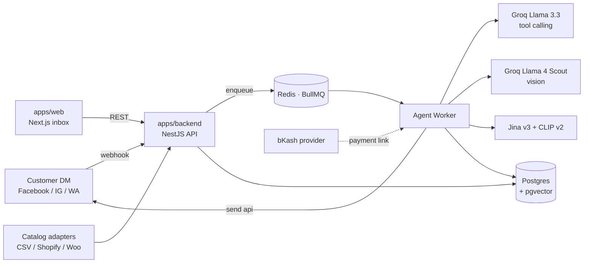

# Jobab

**An AI sales agent for Bangladeshi social-commerce merchants — with a real-time merchant dashboard.**

A merchant connects their Facebook / Instagram / WhatsApp page. Jobab's AI then
replies to customer DMs in Bangla, Banglish, or English: it recognises products
from photos, searches the catalog, recommends, collects delivery details, takes
orders, generates a bKash payment link, and hands off to a human the moment a
customer reports a problem. The merchant watches every conversation in a live
inbox, steps in whenever they want, and manages contacts, orders, and catalog
from one place.

> _Jobab_ (জবাব) means "answer" / "reply" in Bangla.

> **New to this codebase?** Open [`ARCHITECTURE.md`](./ARCHITECTURE.md) — a 10-minute
> tour of how every file in the repo is organised. It's the fastest way to start
> contributing without grepping for half an hour first.

---

## Table of contents

- [What it does](#what-it-does)
- [The dashboard](#the-dashboard)
- [Monorepo layout](#monorepo-layout)
- [Architecture](#architecture)
- [The agent loop](#the-agent-loop)
- [Tech stack](#tech-stack)
- [Data model](#data-model)
- [Run it locally](#run-it-locally)
- [Environment variables](#environment-variables)
- [API reference](#api-reference)
- [Useful scripts](#useful-scripts)
- [Testing](#testing)
- [What's real vs. stubbed](#whats-real-vs-stubbed)
- [License](#license)

---

## What it does

- **Replies in the customer's language** — Bangla / Banglish / English, matching
  their tone.
- **Understands product photos** — a customer sends a picture; the agent matches
  it against the catalog (visual embeddings + vision LLM) and confirms before
  quoting.
- **Grounded selling** — it always searches the catalog before quoting a price,
  checks live stock, and never invents products.
- **Takes orders safely** — an order guardrail re-verifies stock, recomputes the
  total, requires name + phone + address, blocks duplicates, and then mints a
  bKash payment link.
- **Knows when to step back** — on complaints, refund/return requests, payment
  disputes, low confidence, or "I want a human", it hands off to the merchant
  and classifies _why_.
- **Automates post comments** — detects intent on Facebook/Instagram comments
  and replies publicly and/or privately by rule.

## The dashboard

The merchant-facing Next.js app (`apps/web`) is a live inbox plus the tools to
run a shop:

**Inbox**

- Conversation list with last message, relative time, and live triage shading
  for chats that have waited too long.
- **Multi-channel** — Facebook / Instagram / WhatsApp badges on every row and a
  compact channel filter.
- **Filters** — All · Needs you · Complaints · AI · You, plus sort (recent /
  urgent / longest-waiting) and customer search (`⌘/`).
- **AI control** — see what the AI sent ("AI agent" attribution), watch it
  "thinking", take over / hand back per conversation, and reuse the AI's last
  reply as a draft.
- **Agent assignment** — assign a conversation to a teammate; assignee chips on
  rows.
- **Tags** — colour-coded labels (Priority, Top Client, …) editable from the
  thread or the contact panel.
- **Complaints** — when the AI hands off a problem it's classified, badged in
  the list, filtered into a Complaints view, and the reason is banner-pinned in
  the thread for fast follow-up.
- **Customer view** — toggle to see exactly what the customer received.

**Right rail — a stacked CRM panel**

- **Contact details** — name, channel, status, captured phone/address.
- **Order receipt** — the live order assembling in real time as the AI takes it,
  with a "confirm & send payment link" action.
- **Tags**, **Notes** (internal, never shown to the customer), **Activity** (the
  AI's tool calls, tokens, latency, cost), and **Shared files** (every image in
  the conversation).

**Other screens** — Orders (status lifecycle, printable invoice, payment),
Catalog (CSV / Shopify / WooCommerce sync, per-variant stock), Comments
(intent + auto-reply rules), Analytics (AI conversations, revenue, token spend,
latency), Settings (shop name, AI instructions, team), plus auth / onboarding /
invite flows.

## Monorepo layout

```
.
├── apps/
│   ├── backend/        NestJS · Prisma · BullMQ. Agent loop, webhooks, dashboard API.
│   └── web/            Next.js 14 (app router) + Tailwind. The merchant dashboard.
├── packages/
│   └── shared/         Zod schemas + types shared between backend and web (the API contract).
├── docker-compose.yml  Postgres (pgvector) + Redis + optional app containers.
├── docs/               ADRs, architecture notes.
└── design-prototype/   The original Claude Design prototype, kept as visual reference.
```

The `@jobab/shared` package is the single source of truth for API shapes: both
apps import the same Zod schemas, so the contract can't drift.

## Architecture



Two backend processes share one codebase:

- **API** (`start:dev`) — webhooks, the dashboard REST API, auth.
- **Agent worker** (`start:worker:dev`) — drains the BullMQ queue and runs the
  agent loop, so a slow LLM call never blocks an HTTP request.

## The agent loop

```
customer message
    │
    ▼
load context (system prompt + last 40 turns + image URLs)
    │
    ▼
call LLM with tool definitions (≤ LLM_MAX_ITERATIONS)
    │
  tool calls? ──no──▶ send final reply via Send API
    │
    yes
    │
    ▼
execute tool ─ search_catalog        (top-N in-stock products)
              ─ check_stock           (live qty + price for a variant)
              ─ match_product_by_image(visual ANN → describe-then-search → vision LLM)
              ─ save_customer_detail  (grounded against the customer's own messages)
              ─ create_order          (order guardrail: fields · stock · total · duplicate)
              ─ handoff_to_human      (classified: complaint / refund / payment_dispute / …)
    │
    └──▶ append result, re-invoke
```

Every run is recorded as an `AgentRun` (model, tokens, cost, latency, the tool
calls it made) — that's what powers the inbox Activity feed and the Analytics
page. The loop bails immediately if a conversation is in `human` or `closed`
status, so a merchant takeover is always respected.

## Tech stack

| Layer         | Choice                                                                 |
| ------------- | ---------------------------------------------------------------------- |
| Backend       | NestJS 10, TypeScript                                                  |
| ORM / DB      | Prisma + PostgreSQL 16 with **pgvector**                               |
| Queue         | BullMQ on Redis                                                        |
| LLM           | Groq — Llama 3.3 (tool calling), Llama 4 Scout (vision)                |
| Embeddings    | Jina v3 (text) + CLIP v2 (image), with a describe-then-search fallback |
| Frontend      | Next.js 14 (app router), React, Tailwind CSS                           |
| Contract      | Zod schemas in `@jobab/shared`                                         |
| Payments      | bKash (dev fallback without merchant creds)                            |
| Notifications | WhatsApp + web push (merchant alerts)                                  |
| Observability | Pino logs, optional Sentry + Langfuse                                  |
| Tooling       | pnpm workspaces, Jest, ESLint, Prettier                                |

## Data model

Key Prisma models (`apps/backend/prisma/schema.prisma`):

- **Organization** — the shop. Holds AI instructions, catalog source, status.
- **User / Membership / Invite / AuditEvent** — auth + RBAC (`owner` / `admin` /
  `agent`).
- **Page** — a connected channel (`facebook` / `instagram` / `whatsapp`).
- **Product / ProductVariant** — catalog, with `textEmbedding` + `imageEmbedding`
  (pgvector) for search and photo matching.
- **Conversation** — a customer thread. Carries channel, assignee, captured
  `customerName/Phone/Address`, `status` (`bot` → `needs_human` → `human` →
  `closed`), and `handoffCategory` / `handoffReason` for complaint triage.
- **Message** — in/out, sender (`customer` / `agent` / `human`), JSON
  attachments (images + AI match candidates).
- **Tag / ConversationTag** — reusable colour-coded labels applied to chats.
- **Note** — internal merchant notes on a conversation.
- **Order** — items, totals, `paymentStatus`, `status` (created → confirmed →
  shipped → delivered → cancelled).
- **Comment / CommentRule** — social comments + per-intent automation.
- **AgentRun** — per-run model/token/cost/latency/tool-call telemetry.
- **DeviceToken** — web-push registrations.

## Run it locally

Prereqs: **Node 20+**, **pnpm 9+**, **Docker**.

```bash
# 1. Infra — Postgres (pgvector) + Redis
docker compose up -d                                 # or: pnpm infra:up

# 2. Install, build shared types, generate the Prisma client
pnpm install
pnpm --filter @jobab/shared build
pnpm --filter @jobab/backend prisma:generate

# 3. Env + migrate + seed
cp apps/backend/.env.example apps/backend/.env
cp apps/web/.env.example     apps/web/.env.local
# edit apps/backend/.env  → set LLM_API_KEY, ENCRYPTION_KEY (optionally JINA_API_KEY)
# edit apps/web/.env.local → set DEV_PASSWORD

pnpm --filter @jobab/backend prisma:deploy           # apply migrations
pnpm --filter @jobab/backend seed                    # seed "Rongdhonu Boutique"

# 4. Dev — three processes
pnpm --filter @jobab/backend start:dev               # API on :3000, Swagger at /docs
pnpm --filter @jobab/backend start:worker:dev        # agent worker
pnpm --filter @jobab/web dev                          # dashboard on :3001

# 5. Try the loop end-to-end
DEFAULT_PAGE_ID=page_rongdhonu pnpm --filter @jobab/backend send -- \
  --customer fb_tahmina "lal jamdani shari ache? medium lagbe"
```

Open the dashboard at <http://localhost:3001> and the API's auto-generated
Swagger docs at <http://localhost:3000/docs>.

### Already set up? Just start it

If you've already done the one-time setup above, resuming is just infra + three
dev processes:

```bash
# 1. Start Postgres + Redis (skip if already up)
pnpm infra:up

# 2. Three dev processes (separate terminals)
pnpm --filter @jobab/backend start:dev          # API on :3000, Swagger at /docs
pnpm --filter @jobab/backend start:worker:dev   # agent worker (BullMQ consumer)
pnpm --filter @jobab/web dev                    # dashboard on :3001
```

`pnpm dev` from the root starts API + web in parallel but **skips the worker** —
start it separately if you want the AI agent to actually reply.

Re-run these only if the relevant thing changed since last time:

| Change                              | Re-run                                                              |
| ----------------------------------- | ------------------------------------------------------------------- |
| `package.json` / lockfile           | `pnpm install`                                                      |
| Anything in `packages/shared`       | `pnpm --filter @jobab/shared build`                                 |
| `apps/backend/prisma/schema.prisma` | `pnpm --filter @jobab/backend prisma:generate` then `prisma:deploy` |
| Want a fresh DB                     | `pnpm --filter @jobab/backend prisma:reset` then `seed`             |

### How many terminals do I need?

Full local dev: **4 terminals** (3 long-running processes + 1 spare). Infra
(Postgres + Redis) runs detached via `pnpm infra:up`, so it doesn't need one.

| #   | Terminal      | Command                                         | Why                                                                                            |
| --- | ------------- | ----------------------------------------------- | ---------------------------------------------------------------------------------------------- |
| 1   | Backend API   | `pnpm --filter @jobab/backend start:dev`        | NestJS API on `:3000`                                                                          |
| 2   | Agent worker  | `pnpm --filter @jobab/backend start:worker:dev` | BullMQ consumer — runs the AI loop. Without this, customer DMs queue up but never get a reply. |
| 3   | Web dashboard | `pnpm --filter @jobab/web dev`                  | Next.js on `:3001`                                                                             |
| 4   | Spare         | —                                               | For `pnpm infra:up`, fake DMs, prisma commands, git, etc.                                      |

Shortcuts:

- **3 terminals** — skip the spare, briefly stop a dev process when you need a one-off command.
- **2 terminals** — only care about the dashboard UI, not AI replies: `pnpm dev` from root (API + web together) in #1, spare in #2. Skips the worker.
- **1 terminal** isn't viable — both `start:dev` and the worker hold the foreground.

## Environment variables

`apps/backend/.env` (validated by Zod at boot — the app refuses to start if a
required key is missing or malformed):

| Variable                                                       | Purpose                                                   |
| -------------------------------------------------------------- | --------------------------------------------------------- |
| `DATABASE_URL`                                                 | Postgres connection string (pgvector enabled)             |
| `REDIS_URL`                                                    | Redis connection for BullMQ                               |
| `LLM_API_KEY`                                                  | Groq API key (**required**)                               |
| `LLM_PROVIDER` / `LLM_MODEL` / `VISION_MODEL`                  | Model selection                                           |
| `LLM_MAX_ITERATIONS` / `LLM_MAX_OUTPUT_TOKENS`                 | Agent loop limits                                         |
| `JINA_API_KEY`                                                 | Embeddings (optional; falls back to describe-then-search) |
| `ENCRYPTION_KEY`                                               | Encrypts stored catalog credentials (**required**)        |
| `META_APP_SECRET` / `META_VERIFY_TOKEN` / `META_GRAPH_VERSION` | Meta webhook + Send API                                   |
| `MESSENGER_DRY_RUN`                                            | When set, logs outbound messages instead of calling Graph |
| `WA_PROVIDER` / `WA_ACCOUNT_SID` / `WA_AUTH_TOKEN` / `WA_FROM` | WhatsApp merchant alerts                                  |
| `BKASH_*`                                                      | bKash payment credentials (dev fallback without them)     |
| `WEB_ORIGIN` / `PUBLIC_URL`                                    | CORS + absolute URLs                                      |
| `SENTRY_DSN` / `LANGFUSE_*`                                    | Optional observability                                    |
| `PORT` / `NODE_ENV`                                            | Server basics                                             |

`apps/web/.env.local`: `DEV_PASSWORD` (stub auth) and the backend proxy target.

## API reference

REST · JSON · cookie session. **Live interactive docs at `/docs`** (Swagger UI)
once the API is running — every endpoint shown there is the source of truth and
has request / response schemas, error codes, and a working "Try it out" button.

This section is the beginner-friendly tour: how to authenticate, the five
calls that cover the golden path, the error envelope, and the webhook flow.

### Your first API call in 60 seconds

```bash
# 1. Seeded credentials (after `pnpm db:seed`).
EMAIL="owner@rongdhonu.bd"
PASSWORD="rongdhonu1234"

# 2. Log in. The server sets two cookies into cookies.txt:
#      - `session`    : signed user-session token
#      - `jobab_org`  : your active org (we pick the first one for you)
curl -sS -c cookies.txt -X POST http://localhost:3000/auth/login \
  -H 'content-type: application/json' \
  -d "{\"email\":\"$EMAIL\",\"password\":\"$PASSWORD\"}"

# 3. Every call afterwards just needs `-b cookies.txt`.
curl -sS -b cookies.txt http://localhost:3000/auth/me

# 4. Read the inbox.
curl -sS -b cookies.txt http://localhost:3000/conversations | jq '.[0:2]'

# 5. Open the live Swagger and click around:
open http://localhost:3000/docs
```

That's the whole auth model — `cookies.txt` is your session.

### How auth works

| Concept            | Detail                                                                                                                                                                                   |
| ------------------ | ---------------------------------------------------------------------------------------------------------------------------------------------------------------------------------------- |
| **Session cookie** | `session` — HttpOnly, SameSite=Lax. Set by `POST /auth/login` (or `/sign-up`, `/accept-invite`). Browsers persist automatically; with curl use `-c cookies.txt -b cookies.txt`.          |
| **Active org**     | `jobab_org` cookie — the org you're currently working with. Set on login. Switch with `POST /auth/active-org` if you belong to several.                                                  |
| **Public routes**  | `/auth/login`, `/auth/sign-up`, `/auth/accept-invite`, `/auth/invites/inspect`, `/webhooks/*`, `/healthz`, `/readyz`. Everything else returns `401` without a valid `session` cookie.    |
| **Role gating**    | A few endpoints require `owner` / `admin` (creating invites, removing members, updating comment rules). These return `403` if your membership role is too low.                           |
| **Org isolation**  | Every protected query is scoped to the active org server-side. You cannot read or write into another tenant's data even if you guess their IDs — you'll get `404` (intentionally vague). |

### The standard error envelope

Every 4xx / 5xx response from the API uses the same shape — see the `ApiError`
schema in Swagger:

```json
{
  "statusCode": 422,
  "message": ["body.text: String must contain at most 4000 character(s)"],
  "error": "Unprocessable Entity"
}
```

| Code  | Meaning               | What you usually did wrong                                                                                 |
| ----- | --------------------- | ---------------------------------------------------------------------------------------------------------- |
| `400` | Bad request           | Malformed JSON, or a business-rule violation (e.g. "email already registered").                            |
| `401` | Unauthorised          | Missing / expired session cookie. Re-login.                                                                |
| `403` | Forbidden             | Logged in but not allowed: wrong org, wrong role, or a public-route signature mismatch (Meta webhooks).    |
| `404` | Not found             | Resource doesn't exist, or it does but isn't visible to your org.                                          |
| `422` | Unprocessable entity  | Request body failed Zod validation. `message` is a list of `path: reason` strings — show them to the user. |
| `429` | Too many requests     | You hit the rate limiter (`@nestjs/throttler`). Backoff and retry.                                         |
| `500` | Internal server error | We logged it (Sentry / pino). Safe to retry once; if it persists, open an issue with the `x-request-id`.   |

### The golden-path flow — read inbox, reply, take an order

```bash
# Take over from the AI on a specific conversation:
CONV=cm0conv123
curl -sS -b cookies.txt -X POST http://localhost:3000/conversations/$CONV/takeover

# Send a merchant reply:
curl -sS -b cookies.txt -X POST http://localhost:3000/conversations/$CONV/reply \
  -H 'content-type: application/json' \
  -d '{"text":"আপনার জন্য পেয়েছি ভাবি, একটু পরে details পাঠাচ্ছি।"}'

# Read the AI's activity for that conversation (tools, tokens, cost):
curl -sS -b cookies.txt "http://localhost:3000/conversations/$CONV/activity?limit=10" | jq

# Hand back to the AI:
curl -sS -b cookies.txt -X POST http://localhost:3000/conversations/$CONV/hand-back

# Mark an order paid manually (e.g. cash on delivery):
ORDER=cm0order123
curl -sS -b cookies.txt -X POST http://localhost:3000/orders/$ORDER/mark-paid
```

### Endpoint catalog

Every endpoint is grouped by tag in Swagger. The table below is for at-a-glance
navigation; for parameters, request / response shapes, and live examples open
the corresponding tag in `/docs`.

| Tag               | Endpoints                                                                                                                                                                                                                                                                                                                                                                                                                                   |
| ----------------- | ------------------------------------------------------------------------------------------------------------------------------------------------------------------------------------------------------------------------------------------------------------------------------------------------------------------------------------------------------------------------------------------------------------------------------------------- |
| **auth**          | `POST /auth/login` · `POST /auth/sign-up` · `POST /auth/logout` · `POST /auth/accept-invite` · `POST /auth/active-org` · `GET /auth/me` · `GET /auth/invites/inspect`                                                                                                                                                                                                                                                                       |
| **conversations** | `GET /conversations` · `GET /conversations/:id` · `GET /conversations/:id/messages/older?before&limit` · `GET /conversations/:id/activity?limit` · `POST /conversations/:id/takeover` · `POST /conversations/:id/hand-back` · `POST /conversations/:id/reply` · `POST /conversations/:id/assert-product` · `POST/DELETE /conversations/:id/tags[/:tagId]` · `GET/POST /conversations/:id/notes` · `DELETE /conversations/:id/notes/:noteId` |
| **tags**          | `GET /tags` · `POST /tags` · `PATCH /tags/:id` · `DELETE /tags/:id`                                                                                                                                                                                                                                                                                                                                                                         |
| **orders**        | `GET /orders?conversationId&status&payment` · `GET /orders/:id` · `PATCH /orders/:id/status` · `POST /orders/:id/mark-paid`                                                                                                                                                                                                                                                                                                                 |
| **catalog**       | `GET /catalog/products?q` · `GET /catalog/products/:id` · `POST /catalog/sync/csv` · `POST /catalog/sync/shopify` · `POST /catalog/sync/woocommerce` · `PATCH /catalog/variants/:id/stock`                                                                                                                                                                                                                                                  |
| **team**          | `GET /team/members` · `GET /team/invites` · `POST /team/invites` · `DELETE /team/invites/:id` · `DELETE /team/members/:id` · `PATCH /team/assign`                                                                                                                                                                                                                                                                                           |
| **comments**      | `GET /comments?intent&postId` · `GET /comments/rules` · `PATCH /comments/rules/:intent`                                                                                                                                                                                                                                                                                                                                                     |
| **settings**      | `GET /settings` · `PATCH /settings`                                                                                                                                                                                                                                                                                                                                                                                                         |
| **analytics**     | `GET /analytics/summary?days`                                                                                                                                                                                                                                                                                                                                                                                                               |
| **onboarding**    | `GET /onboarding/status` · `POST /onboarding/pages`                                                                                                                                                                                                                                                                                                                                                                                         |
| **push**          | `POST /push/tokens` · `DELETE /push/tokens`                                                                                                                                                                                                                                                                                                                                                                                                 |
| **webhooks**      | `GET /webhooks/meta` (verify handshake) · `POST /webhooks/meta` (signature-verified inbound) · `POST /webhooks/meta/data-deletion` (Meta App Review) · `POST /webhooks/meta/fake` (dev DM) · `POST /webhooks/meta/fake-comment` (dev comment)                                                                                                                                                                                               |
| **health**        | `GET /healthz` (liveness) · `GET /readyz` (DB + migrations check)                                                                                                                                                                                                                                                                                                                                                                           |

### Receiving Meta webhooks

Customer DMs and post comments arrive here:

```
POST /webhooks/meta
x-hub-signature-256: sha256=<HMAC-SHA256(rawBody, META_APP_SECRET)>
content-type: application/json

<Meta-shaped payload>
```

We verify the signature byte-for-byte against `META_APP_SECRET`. If it doesn't
match we return `403` without parsing the body. On match we acknowledge in
< 50 ms (Meta retries on timeout) and the heavy work is queued onto BullMQ — the
agent worker (`start:worker:dev`) drains it out-of-band.

The first time you subscribe, Meta calls `GET /webhooks/meta?hub.mode=subscribe&hub.verify_token=<your secret>&hub.challenge=<random>`.
If `verify_token` matches `META_VERIFY_TOKEN` we echo back the challenge —
that's the entire handshake.

For local development you can skip Meta entirely:

```bash
# Inject a fake DM through the full agent loop:
curl -sS -X POST http://localhost:3000/webhooks/meta/fake \
  -H 'content-type: application/json' \
  -d '{"pageId":"page_rongdhonu","customerId":"fb_tahmina","text":"lal jamdani shari ache?"}'
```

## Useful scripts

| Command                                                        | What                                            |
| -------------------------------------------------------------- | ----------------------------------------------- |
| `pnpm dev`                                                     | All apps in parallel                            |
| `pnpm typecheck`                                               | TypeScript check across every package           |
| `pnpm test`                                                    | Unit tests (Jest) for every package             |
| `pnpm lint` / `pnpm format`                                    | ESLint + Prettier                               |
| `pnpm infra:up` / `pnpm infra:down`                            | Just the Postgres + Redis containers            |
| `pnpm db:migrate`                                              | Prisma `migrate dev`                            |
| `pnpm db:seed`                                                 | Seed Rongdhonu Boutique                         |
| `pnpm --filter @jobab/backend send -- --customer <id> "<msg>"` | Inject a fake customer DM through the full loop |

## Testing

```bash
pnpm test                                   # all packages
pnpm --filter @jobab/backend test           # backend (agent tools, order guardrail, …)
pnpm --filter @jobab/backend typecheck
pnpm --filter @jobab/web typecheck
```

The agent tools, order guardrail, and grounding checks have unit coverage; the
shared schemas give both apps runtime validation for free.

## What's real vs. stubbed

| Piece                                                                        | State                                                              |
| ---------------------------------------------------------------------------- | ------------------------------------------------------------------ |
| Postgres schema, agent loop, order guardrail, BullMQ queue                   | real                                                               |
| Groq tool-calling agent (Llama 3.3)                                          | real                                                               |
| Vision (Llama 4 Scout) + Jina embeddings + pgvector ANN                      | real (Jina key optional; falls back to describe-then-search)       |
| Inbox: channels, assignment, tags, complaints, notes, activity, shared files | real                                                               |
| Meta webhook ingest (signature verified)                                     | real                                                               |
| `POST /webhooks/meta` over HTTPS in prod                                     | requires ngrok / deploy + Meta App Review                          |
| Send API → `graph.facebook.com`                                              | real code; gated by `MESSENGER_DRY_RUN` in dev                     |
| Catalog: CSV / Shopify / WooCommerce                                         | real                                                               |
| Order guardrail (fields · stock · total · duplicate · grounding)             | real                                                               |
| bKash payment link                                                           | dev fallback; production needs merchant creds                      |
| Auth                                                                         | dev password → cookie. Replace with Clerk / Supabase per spec §11. |
| Image embeddings on catalog sync                                             | enabled when `JINA_API_KEY` is set                                 |

## License

MIT
