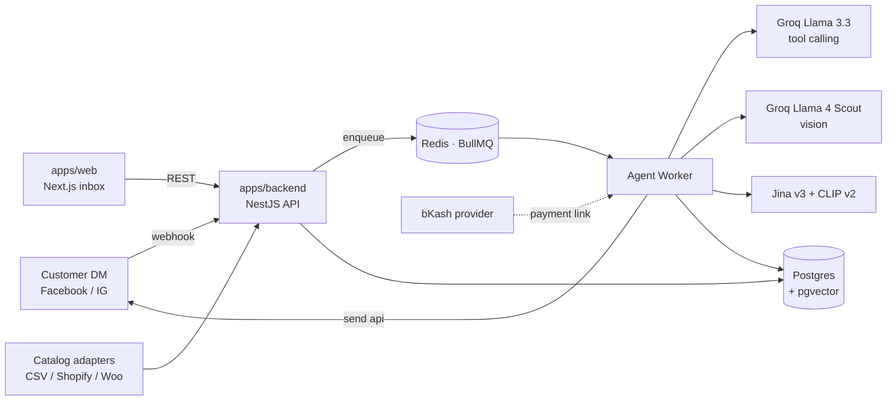

# Jobab

**AI sales agent for Bangladeshi social-commerce merchants.**
A merchant connects their Facebook Page; the AI replies to customer DMs in
Bangla/Banglish/English, recognises products from photos, recommends, takes
orders, and hands off to the merchant when it can't. The merchant uses this
dashboard to watch and step in.

---

## Monorepo layout

```
.
├── apps/
│   ├── backend/        NestJS · Prisma · BullMQ. Agent loop, webhooks, dashboard API.
│   └── web/            Next.js 14 (app router) + Tailwind. The merchant dashboard.
├── packages/
│   └── shared/         Zod schemas + types shared between backend and web.
├── docker-compose.yml  Postgres (pgvector) + Redis + optional app containers.
├── docs/               ADRs, architecture notes.
└── design-prototype/   The original Claude Design prototype, kept as visual reference.
```

## Architecture



The agent loop:

```
customer message
    │
    ▼
load context (system prompt + last 40 turns + image URLs)
    │
    ▼
call LLM with tool definitions (≤ 5 iterations)
    │
  tool calls? ──no──▶ send final reply via Send API
    │
    yes
    │
    ▼
execute tool ─ search_catalog ─ check_stock
              ─ save_customer_detail (grounded against customer messages)
              ─ create_order (order guardrail)
              ─ handoff_to_human
              ─ match_product_by_image (vision LLM + pgvector ANN)
    │
    └──▶ append result, re-invoke
```

## Run it locally

Prereqs: Node 20+, pnpm 9+, Docker.

```bash
# 1. infra
docker compose up -d                           # Postgres + Redis

# 2. install + build shared types + generate Prisma
pnpm install
pnpm --filter @jobab/shared build
pnpm --filter @jobab/backend prisma:generate

# 3. seed and migrate
cp apps/backend/.env.example apps/backend/.env
cp apps/web/.env.example     apps/web/.env.local
# edit apps/backend/.env: set LLM_API_KEY, ENCRYPTION_KEY, optionally JINA_API_KEY
# edit apps/web/.env.local: set DEV_PASSWORD

pnpm --filter @jobab/backend prisma:deploy
pnpm --filter @jobab/backend seed

# 4. dev (3 panes)
pnpm --filter @jobab/backend start:dev          # API on :3000, Swagger at /docs
pnpm --filter @jobab/backend start:worker:dev   # agent worker
pnpm --filter @jobab/web dev                    # dashboard on :3001

# Try the loop
DEFAULT_PAGE_ID=page_rongdhonu pnpm --filter @jobab/backend send -- \
  --customer fb_tahmina "lal jamdani shari ache? medium lagbe"
```

## Useful scripts

| Command | What |
|---|---|
| `pnpm dev` | All apps in parallel |
| `pnpm typecheck` | TS check every package |
| `pnpm test` | Unit tests (Jest) for every package |
| `pnpm lint` | ESLint + Prettier across the repo |
| `pnpm format` | Apply Prettier |
| `pnpm infra:up` / `pnpm infra:down` | Just the Postgres+Redis containers |
| `pnpm db:migrate` | Prisma `migrate dev` |
| `pnpm db:seed` | Seed Rongdhonu Boutique |

## Documentation

- [Architecture decisions](./docs/adr/)
- [Build spec (full product brief)](./docs/BUILD_SPEC.md) — *paste in once you commit it*
- API reference: open <http://localhost:3000/docs> after `start:dev` (auto-generated Swagger).

## What's real vs. stubbed

| Piece | State |
|---|---|
| Postgres schema, agent loop, order guardrail, BullMQ queue | real |
| Groq tool-calling agent (Llama 3.3) | real |
| Vision (Llama 4 Scout) + Jina embeddings + pgvector ANN | real (Jina key optional; falls back to describe-then-search) |
| Meta webhook ingest (signature verified) | real |
| Real `/webhooks/meta` over HTTPS in prod | requires ngrok / deploy + Meta App Review |
| Send API → `graph.facebook.com` | real code; gated by `MESSENGER_DRY_RUN` for dev |
| Catalog: CSV / Shopify / WooCommerce | real |
| Order guardrail (fields · stock · total · duplicate · grounding) | real |
| bKash payment link | dev fallback; production needs merchant creds |
| Auth | dev password → cookie. Replace with Clerk / Supabase per spec §11. |
| Image embeddings on catalog sync | enabled when `JINA_API_KEY` set |

## License

MIT
