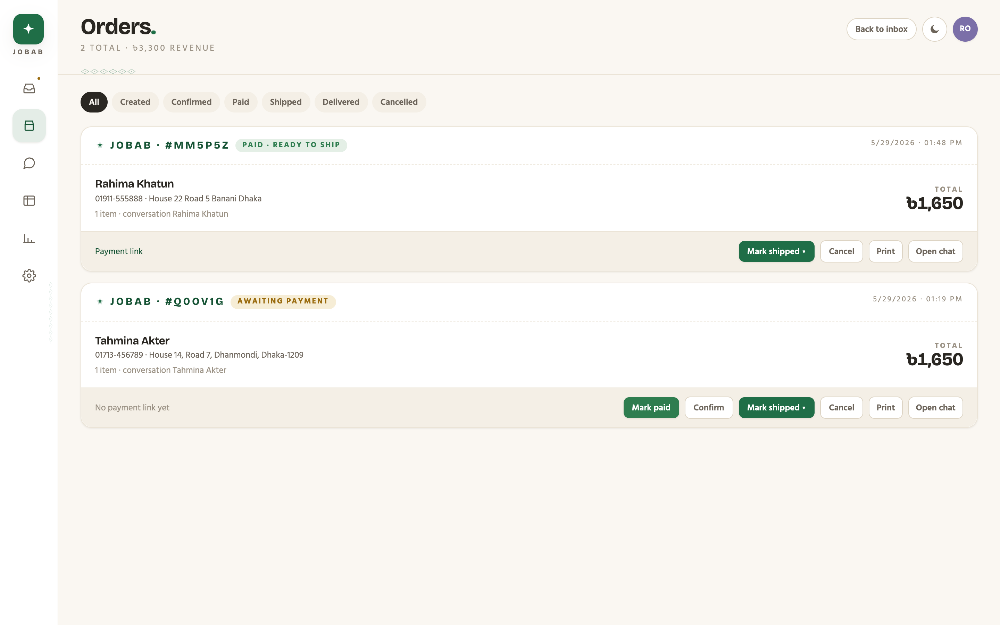
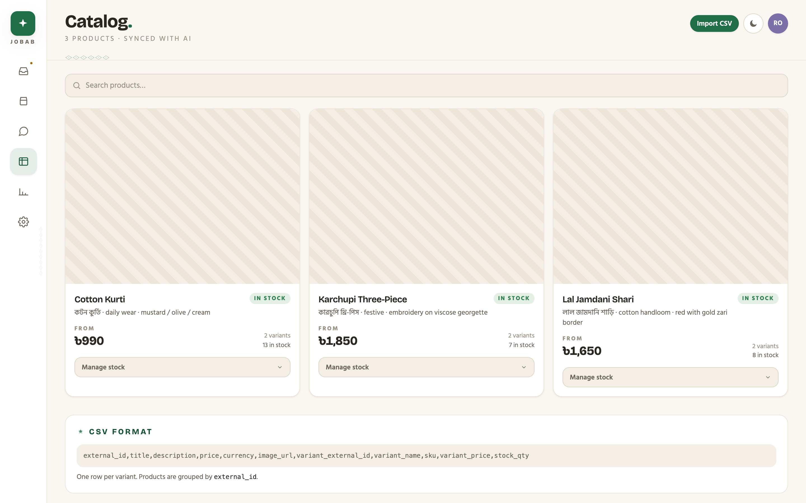
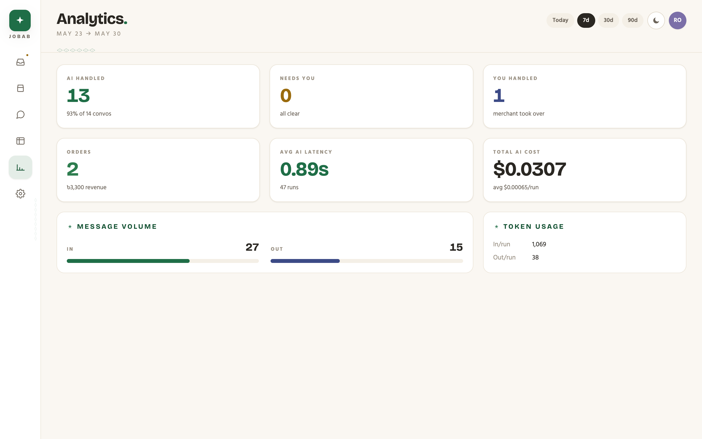
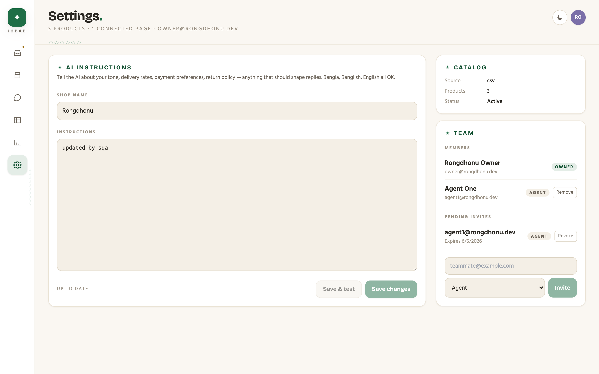

# Jobab

**An AI sales agent for Bangladeshi social-commerce merchants — with a real-time merchant dashboard.**

[](https://nodejs.org)
[](https://pnpm.io)
[](https://nestjs.com)
[](https://nextjs.org)
[](https://www.postgresql.org)
[](#license)

> _Jobab_ (জবাব) means "answer" / "reply" in Bangla.

<p align="center">
  
</p>

A merchant connects their Facebook / Instagram / WhatsApp page. Jobab's AI
replies to customer DMs in Bangla, Banglish, or English: it recognises products
from photos, searches the catalog, recommends, collects delivery details, takes
orders, generates a bKash payment link, and hands off to a human the moment a
customer reports a problem.

The merchant watches every conversation in a live inbox, steps in whenever they
want, and manages contacts, orders, and catalog from one place.

---

## What's real today

| Piece                                                                        | State                                                              |
| ---------------------------------------------------------------------------- | ------------------------------------------------------------------ |
| Postgres schema, agent loop, order guardrail, BullMQ queue                   | real                                                               |
| Groq tool-calling agent (Llama 3.3) + vision (Llama 4 Scout)                 | real                                                               |
| Jina embeddings + pgvector ANN                                               | real (Jina key optional; falls back to describe-then-search)       |
| Inbox: channels, assignment, tags, complaints, notes, activity, shared files | real                                                               |
| Meta webhook ingest (signature verified)                                     | real                                                               |
| `POST /webhooks/meta` over HTTPS in prod                                     | needs ngrok / deploy + Meta App Review                             |
| Send API → `graph.facebook.com`                                              | real code; gated by `MESSENGER_DRY_RUN` in dev                     |
| Catalog: CSV / Shopify / WooCommerce                                         | real                                                               |
| bKash payment link                                                           | dev fallback; production needs merchant creds                      |
| Auth                                                                         | dev password → cookie. Replace with Clerk / Supabase per spec §11. |

---

## 60-second quickstart

Prereqs: **Node 20+**, **pnpm 9+**, **Docker**. Full setup walkthrough lives in
[`docs/runbook.md`](docs/runbook.md).

```bash
# 1. Infra (Postgres + Redis)
pnpm infra:up

# 2. Install + generate Prisma client + migrate + seed
pnpm install
pnpm --filter @jobab/shared build
pnpm --filter @jobab/backend prisma:generate
cp apps/backend/.env.example apps/backend/.env  # set LLM_API_KEY + ENCRYPTION_KEY
cp apps/web/.env.example     apps/web/.env.local
pnpm --filter @jobab/backend prisma:deploy
pnpm --filter @jobab/backend seed

# 3. Three dev processes (one terminal each)
pnpm --filter @jobab/backend start:dev          # API :3000, Swagger /docs
pnpm --filter @jobab/backend start:worker:dev   # agent worker
pnpm --filter @jobab/web dev                    # dashboard :3001

# 4. Send a fake customer DM through the full loop
DEFAULT_PAGE_ID=page_rongdhonu pnpm --filter @jobab/backend send -- \
  --customer fb_tahmina "lal jamdani shari ache? medium lagbe"
```

Open <http://localhost:3001> for the dashboard, <http://localhost:3000/docs>
for the live API.

---

## Where to go next

All docs live under [`docs/`](docs/) with a one-page index at
[`docs/README.md`](docs/README.md). Or jump straight to what you need:

| You want to…                                              | Read                                                                     |
| --------------------------------------------------------- | ------------------------------------------------------------------------ |
| Understand the product, in plain English                  | [`docs/start-here/`](docs/start-here/)                                   |
| Get the project running locally                           | [`docs/build/1-setup.md`](docs/build/1-setup.md)                         |
| Browse the live API in your browser                       | <http://localhost:3000/docs> (Swagger UI)                                |
| Read the API guide — auth, errors, golden path            | [`docs/build/2-api-guide.md`](docs/build/2-api-guide.md)                 |
| Map the codebase                                          | [`ARCHITECTURE.md`](ARCHITECTURE.md)                                     |
| Add a feature end-to-end (worked example)                 | [`ARCHITECTURE.md`, §7](ARCHITECTURE.md#adding-a-new-feature-in-7-steps) |
| Connect a real Facebook / Instagram / WhatsApp page       | [`docs/ship/2-meta-setup.md`](docs/ship/2-meta-setup.md)                 |
| See current project status — what's done, what's blocking | [`docs/status.md`](docs/status.md)                                       |
| Contribute                                                | [`CONTRIBUTING.md`](CONTRIBUTING.md)                                     |

---

## A quick tour

The merchant-facing Next.js app (`apps/web`) is the inbox you saw above, plus
the tools to run a shop.

<table>
  <tr>
    <td align="center" width="50%">
      <a href="docs/img/orders.png"></a>
      <br/><sub><b>Orders</b> — lifecycle (created → confirmed → shipped → delivered), bKash payment status, printable invoice, "notify customer" actions.</sub>
    </td>
    <td align="center" width="50%">
      <a href="docs/img/catalog.png"></a>
      <br/><sub><b>Catalog</b> — products + variants synced from CSV, Shopify, or WooCommerce. Inline per-variant stock editing.</sub>
    </td>
  </tr>
  <tr>
    <td align="center" width="50%">
      <a href="docs/img/analytics.png"></a>
      <br/><sub><b>Analytics</b> — AI-handled vs. merchant-handled conversations, revenue, token spend, mean latency, message volume. Today / 7d / 30d / 90d.</sub>
    </td>
    <td align="center" width="50%">
      <a href="docs/img/settings.png"></a>
      <br/><sub><b>Settings</b> — AI voice ("Be warm. Use the customer's language."), catalog source, team members + pending invites.</sub>
    </td>
  </tr>
</table>

What's covered, briefly:

- **Multi-channel inbox** — Facebook / Instagram / WhatsApp on one screen, with
  filters (All · Needs you · Complaints · AI · You), sort, and customer search.
- **AI control** — see the AI reply in real time, watch it "thinking", take
  over / hand back per conversation, reuse the AI's last reply as a draft.
- **CRM right rail** — contact details, the live order assembling as the AI
  takes it, tags, internal notes, activity feed (tool calls / tokens / cost),
  shared files.
- **Operations** — Orders, Catalog, Comments (intent + auto-reply rules),
  Analytics, Team & Settings.

---

## License

MIT — see [`LICENSE`](LICENSE) if present, or the `license` field in
`package.json`.
